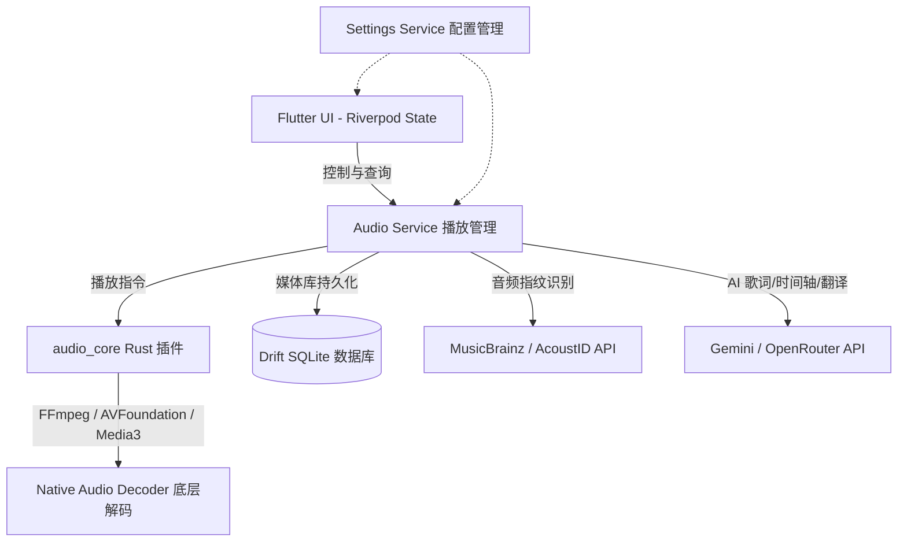

# 🎵 VibeFlow (Pure Player)

[](https://flutter.dev)
[](https://www.rust-lang.org)
[](https://ffmpeg.org)
[](https://ai.google.dev)
[](LICENSE)

**VibeFlow** (在代码中也称为 **Pure Player**) 是一款优雅、功能强大的本地音乐播放器，专为极致音频体验与现代视觉美学设计。它采用 Flutter 构建外壳，底层使用 Rust + FFmpeg 打造高性能的自研解码播放核心，深度融合 Gemini 等大语言模型，提供革命性的 AI 智能歌词与转码管理功能。

---

## 🚀 核心架构与技术栈

VibeFlow 的技术设计遵循“高性能原生底层 + 响应式现代前端”原则：



*   **跨平台前端**：基于 **Flutter** 与 **Riverpod** 状态管理，提供流畅无缝的响应式 UI。
*   **自研音频核心 (`audio_core`)**：通过 **Rust** 结合 FFI / `flutter_rust_bridge` 提供底层音频管道。
*   **多平台 FFmpeg 编解码**：
    *   在 Android 端支持自编译的 **Media3 FFmpeg 扩展**，并在 FFmpeg 缺失时自动后备至系统原生 MediaCodec 管道。
    *   在 Apple 端（macOS/iOS）优先使用 **AVFoundation** 解码主流格式，冷门格式自动解析为 PCM 数据，通过 `AVAudioPlayerNode` 进行硬件加速级别的调度。
*   **本地数据库**：使用高性能 SQLite 的 Dart 封装 **Drift**，实现毫秒级的音乐扫描与本地媒体库管理。

---

## ✨ 亮点功能

### 1. 🧠 AI 智能歌词助理 (Gemini & OpenRouter 驱动)
*   **语音转文字歌词生成**：直接将本地音频文件上传至 Google AI Studio，利用 Gemini 大模型对歌曲进行智能“听写”，自动生成带时间轴的标准 **LRC 格式歌词**。
*   **歌词智能翻译**：利用大模型将外文歌词意译为目标语言（支持中英双向等），在翻译的同时完美保留原歌词的精确时间轴。
*   **时间轴重排与校对**：自动分析本地音频与已有文本歌词，针对时间轴错位或无时间轴的歌词进行智能对齐与微调。
*   **自动容灾切换**：支持配置 Gemini 与 OpenRouter 双重 API Key，当主模型达到限额或响应异常时，自动无感切换。

### 2. 🎛️ FFmpeg 本地音频转码引擎
*   内置转码管理器（`TranscodeService`），支持多种主流及无损格式（AAC, ALAC, AIFF, CAF, FLAC, M4A, M4B, MP3, OGG, Opus, WAV）相互转换。
*   支持预设音质档位（低、中、高、极致）以及自定义声道数、采样率、码率（CBR/VBR）。

### 3. 🎨 现代极致视觉美学 (Rich Aesthetics)
*   **封面色彩自适应主题**：采用 `PaletteGenerator` 实时提取当前播放歌曲专辑封面的核心色彩，动态计算出最契合的 UI 主题与柔和渐变色。
*   **动态流沙背景 (Mesh Gradient)**：基于自定义顶点着色器（Mesh Gradient）的动态流动漸变背景，支持调节流动速度与色彩深度，营造沉浸式音乐氛围。
*   **音乐可视化光谱**：配备精美的实时音频频谱仪表（Spectrum Visualizer）与波形进度条，支持自定义频段密度、采样步长、间距与渐变动效。
*   **全端自适应响应式排版**：
    *   **桌面端**：沉浸式隐藏标题栏、左侧悬浮导航栏、支持键盘全局/局部快捷键、窗口单例运行（支持通过双击关联音频文件直接唤起并追加到播放队列）。
    *   **移动端**：符合现代手势的底部导航、支持划动返回、灵动可缩放的迷你播放器。

### 4. 📂 增量扫描与媒体库管理
*   **智能增量扫描**：支持监听本地文件夹变化（Watcher），文件增删时自动触发增量更新，无需全量重扫。
*   **短音频过滤**：自动识别并跳过微信语音、系统铃声等短音频（可设定秒数阈值，如跳过少于 30 秒的音频）。
*   **标签自动补全**：无标签的本地音乐文件可通过 AcoustID 计算音频指纹，自动对接 MusicBrainz 补全歌曲标题、艺术家、专辑及封面封面。

---

## 🛠️ 配置与安装指南

### 依赖环境
*   **Flutter SDK**: `^3.11.1` 或更新版本。
*   **Rust 工具链**: 用于构建 `audio_core` 底层部分（需要 `cargo` 编译器）。
*   **FFmpeg 开发库**: 多平台编译脚本包含在项目 `audio_core` 中。

### 编译与运行

1.  **克隆项目与子模块**：
    ```bash
    git clone https://github.com/axel10/vibe_flow
    cd vibe_flow
    ```

2.  **构建 & 运行应用**：
    ```bash
    flutter run -d <your-device-id>
    ```

---

## ⚙️ 核心配置项与自定义

在 VibeFlow 的系统设置中，你可以进行丰富的个性化定制：

| 配置模块 | 功能描述 | 关键参数 |
| :--- | :--- | :--- |
| **外观与主题** | 自适应封面取色、深色/浅色/系统模式、流沙背景流动速度。 | `visualizer_dynamic_color`, `playback_background_type` |
| **音乐频谱** | 频谱间距、频谱数量、不透明度、渐变起止色、波形进度条。 | `visualizer_color`, `visualizer_opacity`, `waveform_progress_bar_enabled` |
| **AI 歌词助手** | Google AI Studio / OpenRouter 提供商切换、模型 ID 选择、API 密钥管理。 | `lyrics_ai_provider`, `gemini_primary_model_id` |
| **音频转码** | 默认输出格式、默认转码质量、自定义外部 FFmpeg 路径。 | `transcode_default_output_format`, `transcode_ffmpeg_path` |
| **键盘快捷键** | 播放暂停、上一曲/下一曲、音量加减、静音、快进/快退、全屏切换。 | `shortcut_bindings` |

---

## 🤝 参与贡献

如果你想为 VibeFlow 贡献代码：
1. 请确保你遵守 `analysis_options.yaml` 中的 Lint 规则。
2. 提交 PR 前请在本地运行 `flutter test` 确保没有破坏已有测试。

---

## 📝 许可证

本项目采用 **GNU General Public License v3.0** (GPL-3.0) 授权开源。有关详细许可条款，请参阅 [LICENSE](LICENSE) 文件。
